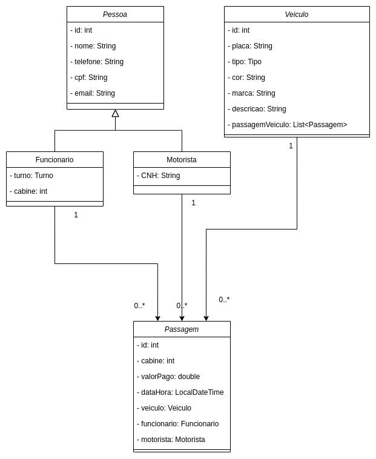

# ProjetoLPOOE1_LeopoldoNetoRodrigues

Atividade Avaliativa Etapa 1 – parte Prática (peso 2.0)

Desenvolvimento de Projeto com JDBC, JPA e Maven

### Objetivo
Desenvolver um projeto Java que utilize JDBC e JPA para gerenciar o acesso a um banco de dados PostgreSQL. O projeto deve ser gerenciado com Maven, versionado no Github e conter pelo menos três classes relacionadas com mapeamento de relacionamento e, preferencialmente, uma relação de herança.

### Modelagem

